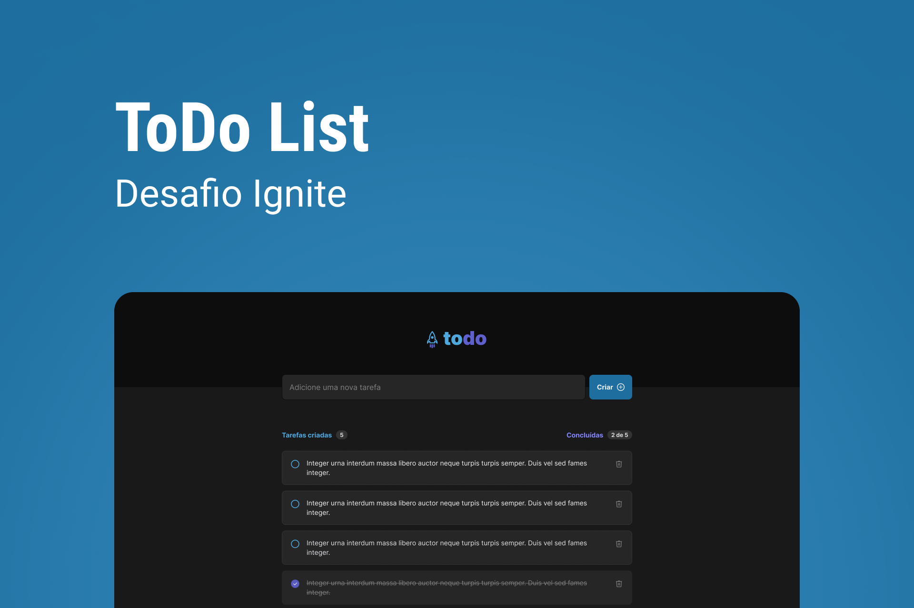

# Todo-React-JS

Atividade proposta pela Rocketseat para pratica de Conceitos do React-JS.

> Desafio Rocketseat

Projeto construído com base no layout disponibilizado em Figma pela Rocketseat.

## 🛠 Tecnologias

- Vite
- TypeScript
- Fundamentos React
- Componentização
- Propriedades
- Imutabilidade
- Hooks
